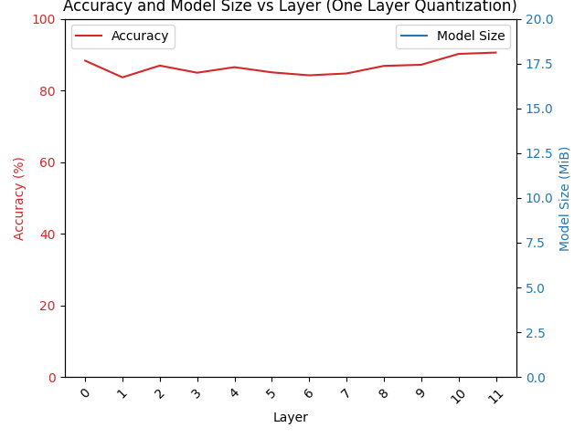
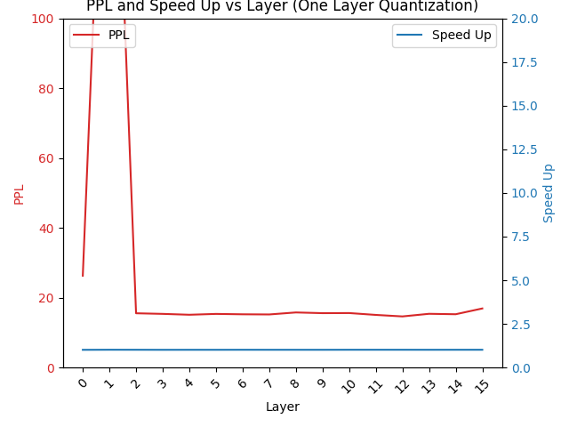
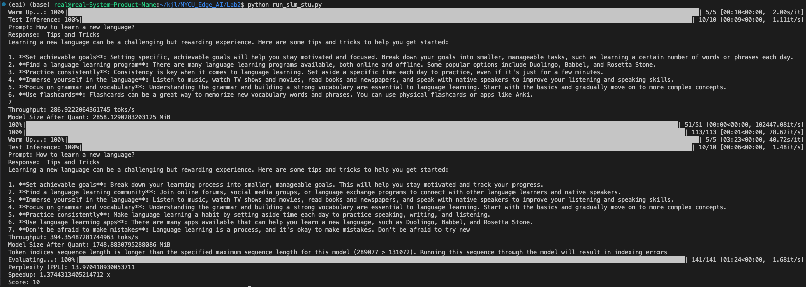

# Lab2 report
1. Try to quantize `DeiT-S` from FP32 to nbit integer (n=8,4,3,2), fill in the following chart. **(group_size=64)** **(10%)**
    
|       nbit       |   32   |  8  |  4  |  3  |  2  |
|:----------------:|:------:|:---:|:---:|:---:|:---:|
|   Accuracy (%)   | 90.99  |90.99|  89.59   |  84.77   |   4.29  |
| Model Size (MiB) | 82.540 |24.321|14.196    |  12.177   |  9.133   |

2. Try to quantize `Llama3.2-1B-Instruct` from FP16 to nbit integer (n=8,4,3,2), fill in the following chart. **(group_size=64)** **(10%)**

|        nbit         |    16    |  8  |  4  |  2  |
|:-------------------:|:--------:|:---:|:---:|:---:|
|  Perplexity (PPL)   |  13.160  |13.167   |  15.050   |   215784.171  |
|  Model Size (MiB)   | 2858.129 |1988.133  |  1524.133   |   1292.133  |
| Throughput (toks/s) | 286.576  |286.948   |   454.881  |  471.910   |

3. Explain how you determine the quantization method for `DeiT-S` and `Llama3.2-1B-Instruct` for best performance. If you can provide a visualized analysis or any chart according to your experiment would be better. **(15%)**

- DeiT-S
    - Investigating which layer do most impact on performance (2 bit quantize on one layer):
    - 
    - From the chart, we can see that when we quantize on second, third and middle layer, the accuracy drops more. These layers are more important than others.
    - The following list shows the quantized bit for each layers: [4,8,4,4,4,4,8,4,4,4,8,2]. We 8-bit quantized the second layer, sixth layer and tenth layer which are more important than others. The last layer is quantized to 2-bit, since it is last important. This configuration got accuracy After Quant: 89.97% and Model Size (MiB) 16.305 MiB. The total score is 20.39

- Llama3.2-1B-Instruct
    - Investigating which layer do most impact on performance (2 bit quantize on one layer):
    - 
    - We can see first two layer is very important since PPL become very high when it got quantized. So we can construct a simple strategy: quantize 8bit on first two layer, quantize 4bit on others.
    - This configuration got Perplexity (PPL): 13.97, Speedup: 1.3744 and Score: 10.

4. Which model is harder to quantize, what might be the reason ?  **(5%)**
    - In my opinion, DeiT is harder too quatize. Since the importance of each layer is not simple distributed as Llama. In Llama, we can simply see that the first two layers are more important than others. But in Deit, the middle layers are also important, so it is not trivial to quantize.

5. Please attach screenshots showing the speedup and PPL of `Llama3.2-1B-Instruct` in your report. The screenshot will be used as the evidence in case performance drops due to different hardware platform. **(For Criteria of Section 2.2)**
    - 
